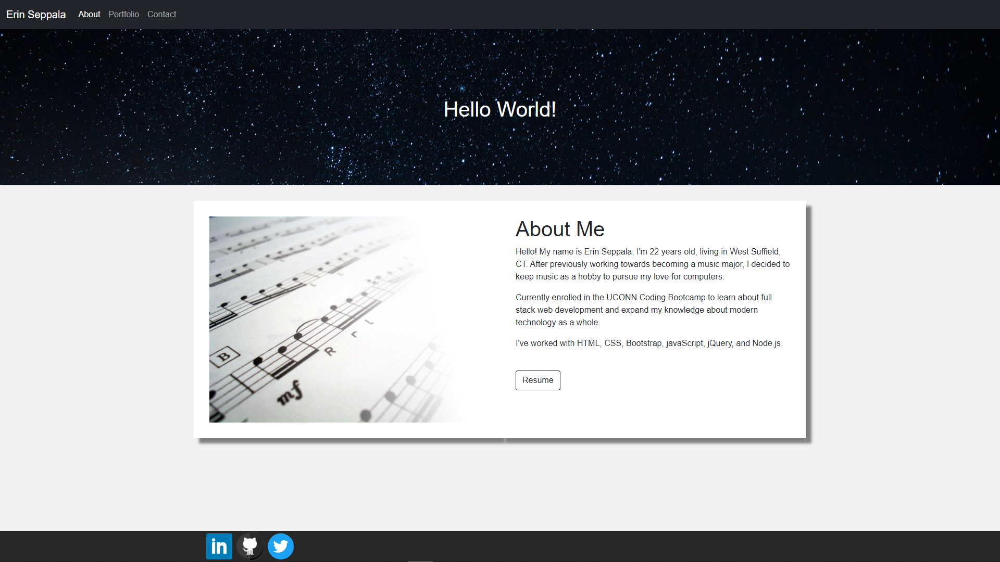
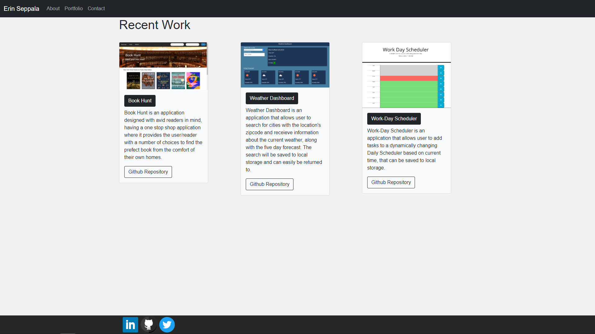
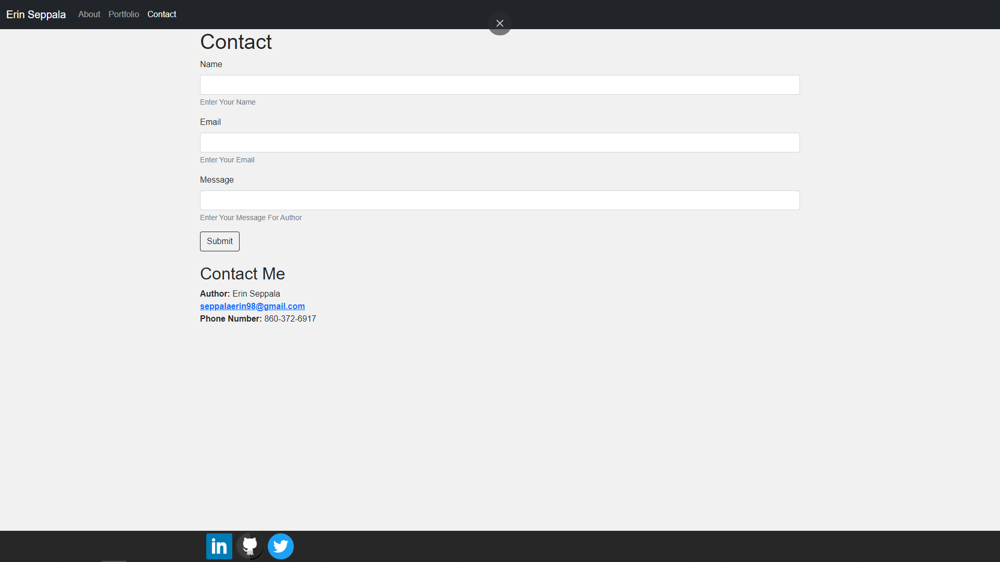

# Portfolio

## Description
This application is created as a mobile responsive portfolio, using the Bootstrap CSS Framework with a navbar, responsive layout, and responsive images. The application includes an index page describing the author, a portfolio page that displays projects, and a contact page containing information on how to contact the author.

The Deployed Application can be accessed at : [Responsive-Portfolio](https://seppalaerin.github.io/Responsive-Portfolio/)

# Technologies Used:
-HTML
-CSS
-Bootstrap v5.0.0

# Index Page Describing The Author

# Portfolio Page Displaying Projects

# Contact Page Containing Contact Info

## Questions
* My repositories can be found at https://www.github.com/seppalaerin
* For any questions regarding this application, you can email me at SeppalaErin98@gmail.com
